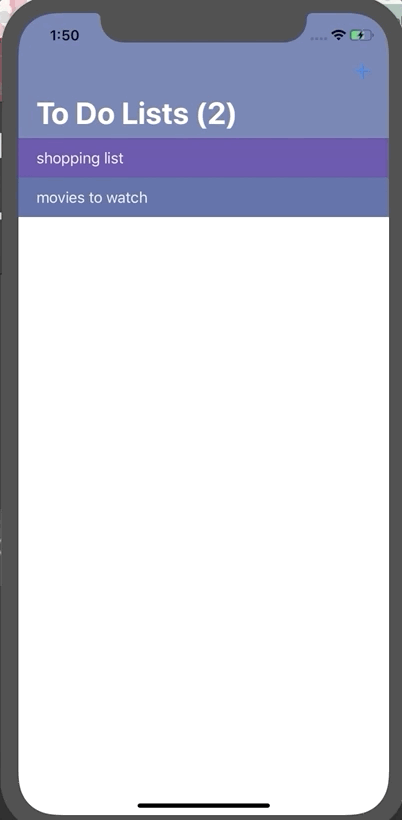
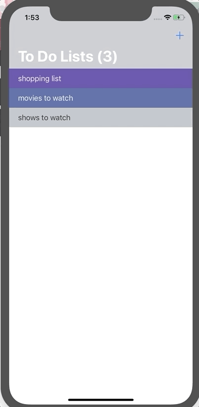

# ToDoLists
An app that enables users to create to-do lists and save items under them.  

# Introduction
Being forgetful is an issue that most people have.  People often don't remember what they are supposed to do, what groceries to get, or what errands to run when they are free.  ToDoLists is an app designed to help users stay organized in their everyday lives.  This versatile app enables users to add a category and add items under the category like to-do tasks.  It can be used to help people keep track of what to buy on their next grocery run, what movie to watch next, or what tasks they must finish before the end of the day. 

# Technologies
- Swift 4
- Xcode 10.1
- Core Data
- Cocoapod: ChameleonFramework

# Setup
To run this project, install it locally using Terminal...
```
$ git clone https://github.com/janezhu1618/ToDoLists
$ open ToDoLists.xcworkspace
```

# Usage
User can simple add a new category by pressing the "+" button at the top right corner.  After a category is created, the user can click on the category to go to another page that allows them to add items underneath this category.  User can tap on the item to check it off when the task is completed. To delete a category or an item, simply swipe left to display the delete button.

ToDoLists uses Core Data to save information. 

# GIFs


